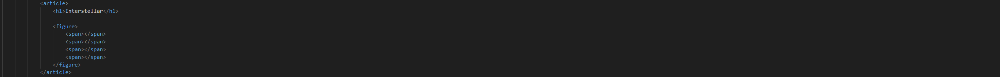
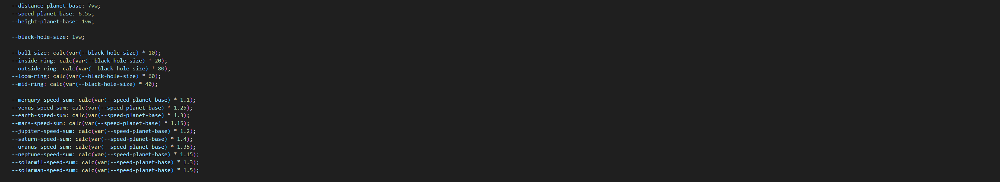
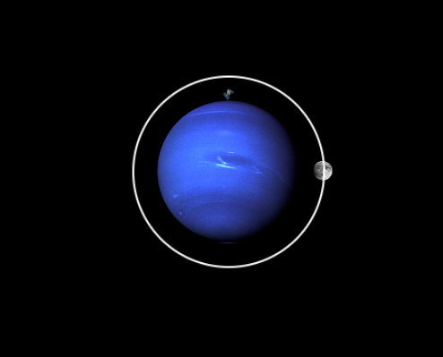
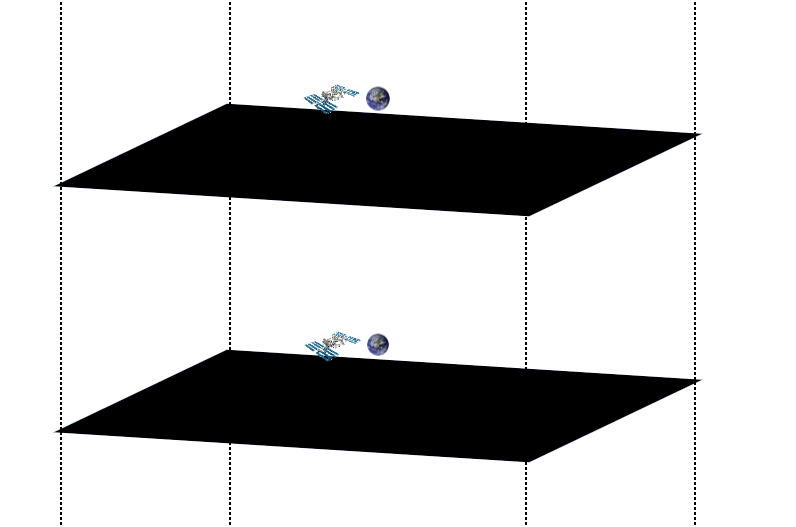
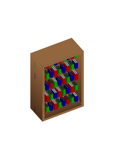
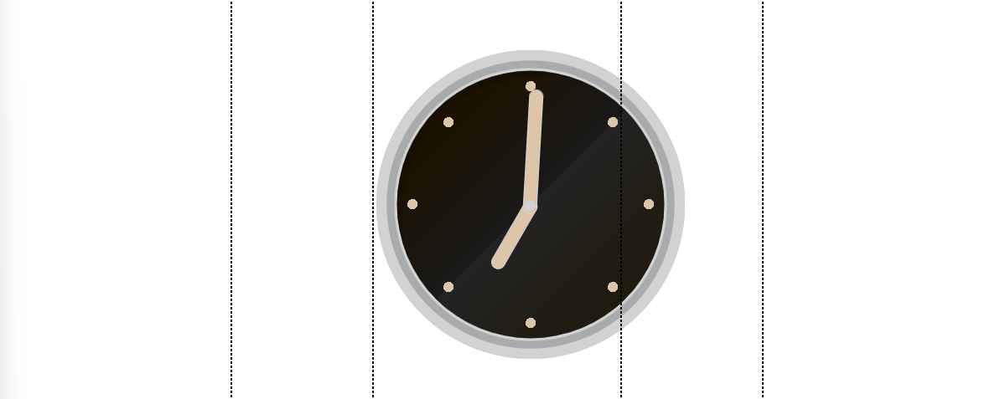

# cssInterstellar
In dit project gaan we volledig met html en css een opdracht uitvoeren. Ik heb ervoor gekozen om een tijdlijn te gaan maken van interstellar. Hierbij is het plan om de endurance door de ruimte in de reis op zoek naar een bewoonbare planneet. We gaan de 2 verschillende perspectieven volgen, die van cooper en die van haar dochter merv. We gaan laten zien hoe de tijd relatief is en hoe de tijd die de twee characters hebben ervaren anders zijn van elkaar. 

Ik wil graag om deze reis zo goed mogelijk te visualiseren 3D, custom propperties, scroll-driven animations en gradients gaan gebruiken. 

## Conceptualizatie
Het plan is om de Pov van cooper te volgen door zijn ruimte reis heen. Dit ga ik doen met scroll animaties. Maar er is een stukje van de reis waar ik goed over na moet denken. Op een gegeven moment gaat cooper een zwart gat in en zodra hij dit doet word hij energy. Hierna ziet hij tijd als posities in ruimte. Dit wil ik visualiseren door de reis die hij heeft gemaakt neer te leggen in stukken van de ruimte waar hij doorheen springt.

Dit is een tekening van hoe ik wil dat het er uit ziet:

## Planet Earth
Let's start at the beginning of the story, at earth. I have made the plannet by overlaying images inside a figure. De html ziet er zo uit:

Zoals je ziet bestaat de figure uit verschillende span's waar background images in zitten die met een animatie bewegen. Bij dit onderdeell hebt ik een aantal dingen geleerd en gebruikt om het effect te krijgen.

Dit is een voorbeeld van de code die ik heb gebruikt in een van de span's:

<code>
            span:nth-of-type(1) {
                animation: rotate-day 80s linear infinite;
                background-image: url(https://www.solarsystemscope.com/textures/download/2k_earth_daymap.jpg);
                background-size: 200%;
                width: var(--earth-height);
                height: var(--earth-height);
                border-left: solid 1px var(--space-color);
                border-radius: 50%;
                box-shadow: 5px 0 20px 10px var(--off-black) inset;
                position: absolute;
                z-index: 3;
            }
</code>

Deze code herhaal ik 3 verschillende keren. 1 voor de plaatjes van de aarde, een voor de wolken en een voor een extra schaduw om de aarde rond te laten lijken. Tijden het maken van de aarde heb ik gebruik gemaakt van een aantal technieken die ik steeds vaker ben gaan gebruiken binnen de applicatie. 

De belangrijkste techniek is het gebruik van box shadows en custom properties. In het begin heb ik een aantal custom properties gemaakt als basis waar ik calcs over heen gooi om ze aan te passen. 

Dit is een voorbeeld van de box shadows die ik heb gebruikt: 
<code>      
    box-shadow: 5px 0 20px 10px var(--off-black) inset, -9px 0px 20px 10px var(--light-blue-glow) inset;
</code>
Wat je hier ziet gebeuren is 5px verplaatsing in de x-as, 0px in de y-as, 20px vervaging en 10px verspreiding. 

## De Titel
Tijdens de lessen van Roel heb ik geleerd over Variable fonts en wat je er mee kan doen. Om dit uit te proberen in mijn eigen website heb ik een font uitgekozen genaamd emberly. Ik heb dit font gekozen omdat het een mooi oud font is dat een beetje lijkt op het font die de film ook gebruikt. Ik heb een animatie gemaakt met dit font om nog wat meer intrige te creeeren met het font. Hier maakt ik gebruik van de kwaliteiten van een Variable font. Ik pas in de animatie dit aan: 
<code>
    font-variation-settings: "wght" 200, "wdth" 75; 
</code>
Door dit aan te passen kan ik een smooth animatie maken die geleidelijk het font dikker en breder maakt. 

## werken met 3D
Tijdens dit project heb ik voor het eerst met 3D gewerkt. Dit komt voor op verschillende plekken. De eerste keer dat ik hier gebruik van maakte met behulp van de code van sanne (https://codepen.io/shooft/pen/PogNKdx). Ik heb gebruik gemaakt van Transforms-chainen om een maan te laten roteren om een planneet. 
Hoe het er uit ziet:

De code:
<code>
    0% {
    transform: rotateY(0turn) translateZ(10vw) rotateY(0turn);
    }
    100% {
        transform: rotateY(1turn) translateZ(10vw) rotateY(-1turn);
    }
    </code>

Dit was mijn eerste kennis making met 3D. Dit was natuurlijk in combinatie met animatie om het draai effect te geven. De volgende keer dat ik 3D gebruikte bij de verschillende lagen in de relatieviteits sectie:

Dit was niet al te moeilijk voor elkaar te krijgen. De enige stappen die ik moest zetten was op de container <code>transform-style: preserve-3d;</code> zetten en dan met transform gaan spelen met een div om het 3D effect te krijgen. <code>transform: rotateX(80deg) rotateZ(20deg);</code>

Nu vielen deze voorbeelden behoorlijk mee dus bedacht ik dat ik een nog wat uitdagender iets wou maken. Dit kwam in de vorm van een kast. Hierbij heb ik wat hulp gevraagd aan david en die stuurde een stukje van zijn code voor het maken van cubussen. Dit ging door eerst de container te stylen. Ik roteer die om goed neer te zetten en de kast juist te roteren

<code>
    transform-style: preserve-3d;
    left: 5%;
    top: 10%;
    transform: rotateX(-40deg) rotateY(calc(360deg - var(--camera-rotation)));
</code>

hierna ging ik aan de slag met de zijdes van de cubussen. Dit deed ik door eerst de lengtes en van de zijdes te standaardiseren met custom properties:
<code>
    --cube-container-size: 8vw;
    --cube-face-size: 6em;
    --long-face: calc(var(--cube-face-size)*1.5);
    --short-face: calc(var(--cube-face-size)*.5);
    --camera-rotation: 330deg;
</code>
Hierna calculeerde ik de posities van de zijdes met transform, transform-origin en rotate:
<code>
    translate: var(--cube-face-size) calc(var(--cube-face-size) / -4) var(--short-face);
    rotate: y 90deg;
    transform-origin: left;
</code>
De translate werkt door de XYZ assen te manipuleren. Hierboven zie je bijvoorbeeld dat deze face (de linker) de lengte van cube-face-size in de x-as en de y-as word op geschoven en een --short-face in z as. Nu doordat we het draaien met 90 graden. 

Nu heb ik de voorkant van de cubus gevuld met meer div's zodat ik de kast kan vullen met meer cubusen. Dit is hoe het er uit ziet:

Ik heb de boeken elke keer een stukje aangepast door gebruik te maken van --index. Dit is een erg handige techniek waarmee je toch een soort ranomization kan verwerken in je design. Dit is hoe de code er uit ziet:
<code>
    div:nth-of-type(3n) div {
        --factor1:1.1;
    }
    div:nth-of-type(1n) div {
        --factor2:.85;
    }
    div:nth-of-type(5n) div {
        --factor3:1.05;
    }
    div:nth-of-type(8n) div {
        --factor4:.9;
    }

     translate: 0 calc(calc(var(--book-face-size)*var(--factor1,1)*var(--factor2,1)*var(--factor3,1)*var(--factor4,1)) - calc(var(--book-face-size)*var(--factor1,1)*var(--factor2,1)*var(--factor3,1)*var(--factor4,1)) / 4) 0;           
     width: calc(var(--book-short-face)*var(--factor1,1)*var(--factor2,1)*var(--factor3,1)*var)
</code>

Ik gebruik de factoren om kleine aanpasingen te doen in de translate en widths. Dit is een handig trucje dat ik waarschijnlijk vaak opnieuw ga gebruiken. 

## werken met masks en gradients

Ik heb binnen dit project vaak gradients en masks gebruikt. Dit komt voornamelijk voor bij de klok en het zwarte gat. Ik heb veel geleerd over dit onderwerp tijdens dit project en denk dat dit vaak bruikbaar zal zijn. Dit is de code die ik heb gebruikt voor de achtergrond van de klok:

<code>
        background: no-repeat top 3vw center / 1vw 1vw radial-gradient(rgba(221, 197, 169, 1), rgba(221, 197, 169, 1) .5vw, rgba(0, 0, 0, 0) .5vw), no-repeat top 6.5vw right 6.5vw / 1vw 1vw radial-gradient(rgba(221, 197, 169, 1), rgba(221, 197, 169, 1) .5vw, rgba(0, 0, 0, 0) .5vw), no-repeat center right 3vw / 1vw 1vw radial-gradient(rgba(221, 197, 169, 1), rgba(221, 197, 169, 1) .5vw, rgba(0, 0, 0, 0) .5vw), no-repeat bottom 6.5vw right 6.5vw / 1vw 1vw radial-gradient(rgba(221, 197, 169, 1), rgba(221, 197, 169, 1) .5vw, rgba(0, 0, 0, 0) .5vw), no-repeat bottom 3vw center / 1vw 1vw radial-gradient(rgba(221, 197, 169, 1), rgba(221, 197, 169, 1) .5vw, rgba(0, 0, 0, 0) .5vw), no-repeat bottom 6.5vw left 6.5vw / 1vw 1vw radial-gradient(rgba(221, 197, 169, 1), rgba(221, 197, 169, 1) .5vw, rgba(0, 0, 0, 0) .5vw), no-repeat center left 3vw / 1vw 1vw radial-gradient(rgba(221, 197, 169, 1), rgba(221, 197, 169, 1) .5vw, rgba(0, 0, 0, 0) .5vw), no-repeat top 6.5vw left 6.5vw / 1vw 1vw radial-gradient(rgba(221, 197, 169, 1), rgba(221, 197, 169, 1) .5vw, rgba(0, 0, 0, 0) .5vw), linear-gradient(to bottom right, #1c1200 25%, #191919 50%, #232323 50%, #1e1400 100%);
        box-shadow: inset 0 0 0 1vw #d1d2d4, inset 0 0 0 1.75vw #aaabad, inset 0 0 0 2vw #d1d2d4, inset 1vw 1vw 0 1.5vw rgba(0, 0, 0, .15);
</code>

Hier zien we twee onderdelen die de basis van de klok op maakte. Laten we even een klein stukje er uit nemen en goed bekijken. <code>no-repeat top 3vw center / 1vw 1vw radial-gradient(rgba(221, 197, 169, 1), rgba(221, 197, 169, 1) .5vw,</code> Dit stukje is om de stip voor de 12 te signaleren. We maken het rondje 1 bij 1 vw en zetten hem 3vw van de top af. Als je alle stipjes hebt gedaan en de andere achtergrond gradient hebt af gemaakt dan ziet de klok er zo uit:

Dit was een leuk voorbeeld van hoe ik gradients heb gebruikt in dit project.

## scroll() en view() animaties
Natuurlijk heb ik ook gebruik gemaakt van scroll() en view() animties. Dit kun je terug zien bij de animaties van het zwarte gat, de relativiteits sectie en het bewegende ruimte station. 

Dit was gelukkig niet nieuw en ging vrij snel goed. Dit is de code die ik er voor heb gebruikt:
<code>
    animation-timeline: scroll(); 
</code>

## wat had ik nog meer gedaan als ik meer tijd had
Ik denk dat ik alles relatief goed af heb gekregen maar ik had graag meer tijd willen besteden aan de relativiteits sectie. Daar had ik het verhaal van cooper nog wat beter kunnen visualiseren. Maar voor de rest ben ik behoorlijk tevvreden met hoe alles er uit ziet. Ik heb veel geleerd over verschillende onderdelen van css en ben denk ik een stuk beter geworden in coderen.

## bronnen

https://developer.mozilla.org/en-US/docs/Web/CSS/CSS_images/Using_CSS_gradients
https://codepen.io/JeffreyTaylor/pen/zZgKvw
gebruikt om meer te leren over gradients

https://3dtransforms.desandro.com/box
https://css-tricks.com/css-in-3d-learning-to-think-in-cubes-instead-of-boxes/ 
leren over 3D

https://css-tricks.com/books/greatest-css-tricks/scroll-animation/ 
scroll animation