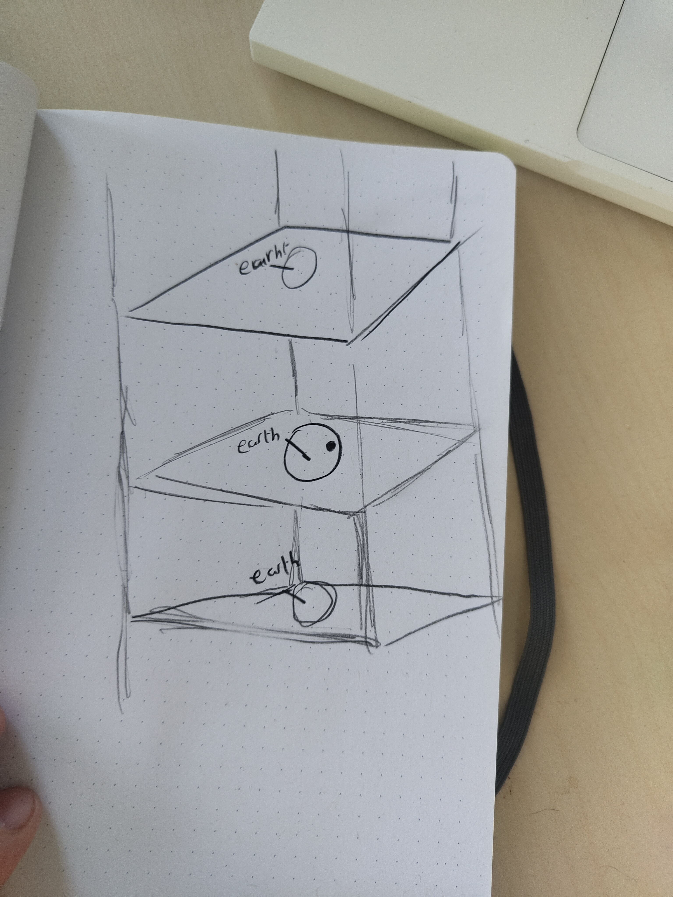

# cssInterstellar

## week 1
In dit project gaan we volledig met html en css een opdracht uitvoeren. Ik heb ervoor gekozen om een tijdlijn te gaan maken van interstellar. Hierbij is het plan om de endurance door de ruimte in de reis op zoek naar een bewoonbare planneet. We gaan de tijd laten zien waar de astronauten en de cooper familie thuis op aarde door heen gaan. Dit zal character specifiek zijn door de time-space distortion die het zwarte gat gargantua veroorzaakt. Dit zal door worden getrokken tot Cooper het zwarte gat in gaat, hierbij word namelijk het moeilijke om relativiteit te visualiseren waar cooper energie is en een outside observer word van tijd en ruimte zelf. 

De stijl die ik wil gaan implementeren is een 3D stijl. Ik wil dat het werkelijk voelt alsof je de endurance door de ruimte heen kan zien bewegen.

Waar ik graag beter in wil worden en dus ga gebruiken binnen dit project zijn: 3D, custom propperties en scrolling animations.

Dit is een schets van hoe ik denk dat het er uit gaat zien:

## week 2

In week 2 heb ik voornamelijk veel testjes gedaan die op een aantal plekken zijn gevaald. Ik heb wat probeersels gedaan met 3D, animaties van planeten en nog een aantal dingen. Uiteindelijk kwam ik er achter dat ik even terug moest stappen en mischien even opnieuw beginnen. Ik was namelijk begonnen met coderen zonder een echt plan. Hierom heb ik een tweede html pagina gemaakt waar ik even alleen de belangrijkste onderdelen ben gaan maken om een beter geheel te krijgen. Dit heeft denk ik gehopen aangezien ik nu een stuk beter weet wat ik ga doen.

## week 3

This week I finished up the code for the scrolling section. This was done by adding animation timeline: scrol() on the objects I wanted to move. using translateY to move everything in keyframes. 

after being done with the scrolling animations I started working on a small 3D section. I have just started with this and don't have much yet but it is starting to get somewhere. 